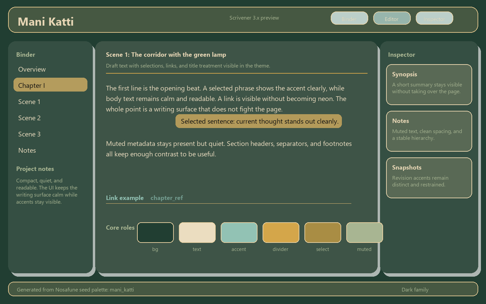
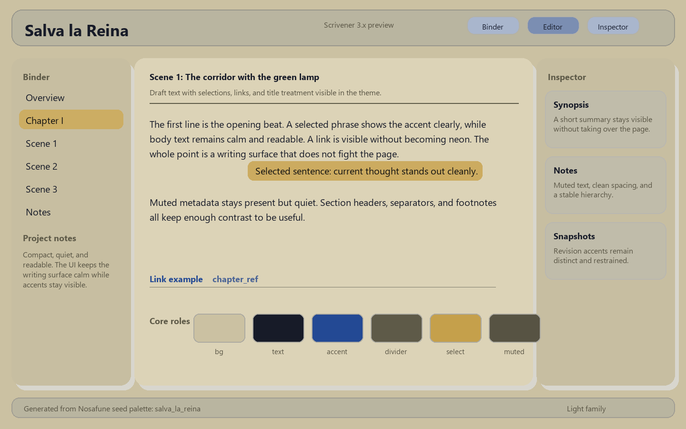
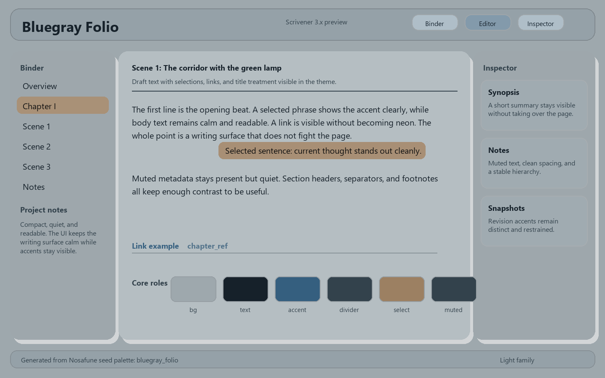

# Free Scrivener Themes

Finished Windows Scrivener 3.x themes.

## Themes

- `themes/mani_katti.scrtheme`
- `themes/salva_la_reina.scrtheme`
- `themes/majima.scrtheme`
- `themes/mav_buster.scrtheme`
- `themes/commoner_king.scrtheme`
- `themes/bluegray_folio.scrtheme`

## Representative Screenshots

### Mani Katti

### Majima

### Salva la Reina

### Mav Buster

### Commoner King

### Bluegray Folio

## Install

Import a theme in Scrivener via:

`Window > Themes > Import Themes`

## Compile Guide

GitHub renders the guide folder index here:

- `Compile_Guide/README.md`

## Notes

- This public repo is release-only.
- Source and build tooling live outside the public repo.
