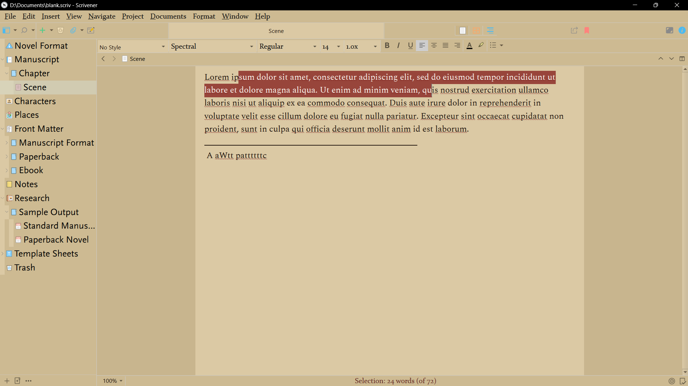
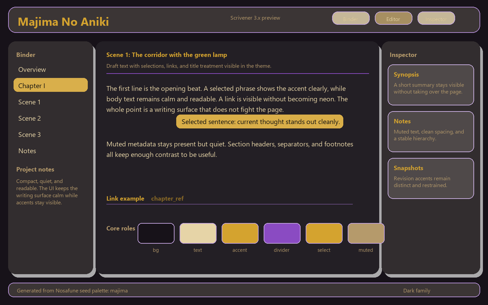
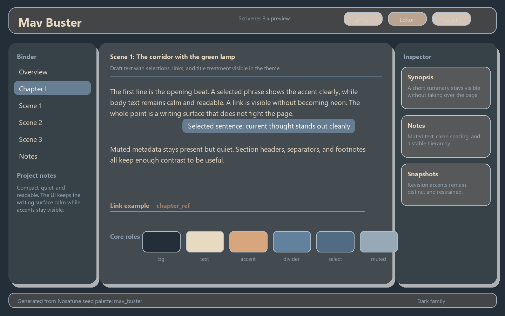
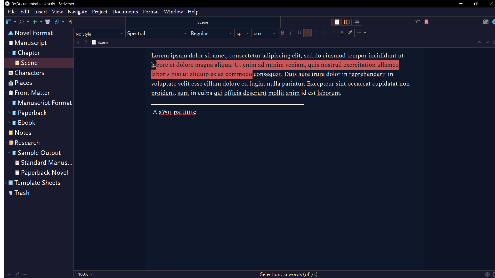
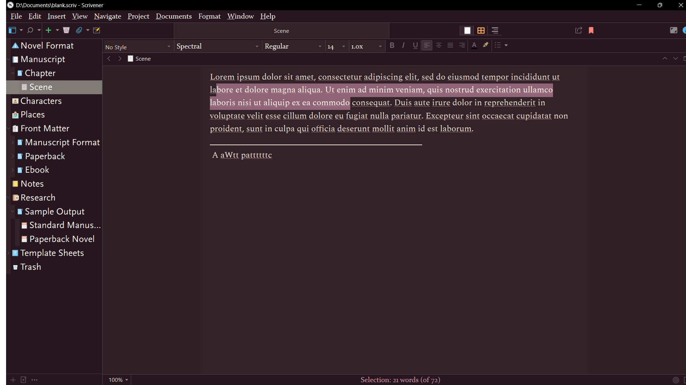
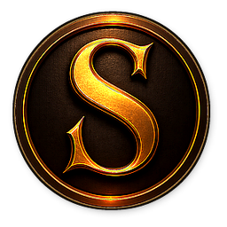

# Free Scrivener Themes for Windows

Free Scrivener 3 themes for writers who want a better drafting workspace.

30 finished themes — dark, light, colorful, muted, and high-contrast. Built for long writing sessions.

Download the latest release:

**https://github.com/Nosafune/free-scrivener-themes/releases/latest**

If these saved you some time, a coffee means a lot: [ko-fi.com/nosafune](https://ko-fi.com/nosafune)

---

## Themes

Windows `.scrtheme` files for Scrivener 3. Import via `Window > Themes > Import Themes`, then restart Scrivener.

| Theme | Vibe |
|---|---|
| Mani Katti | Dark gold — clean and focused |
| Mav Buster | Warm orange on dark — high contrast |
| Majima | Deep purple — moody and immersive |
| Night Tropics | Dark teal — lush and atmospheric |
| Sovereign | Rich navy — formal, composed |
| Commoner King | Earthy mid-tone — comfortable long sessions |
| Amberlight | Amber on near-black — easy on the eyes |
| Abyssal | Deep blue-black — minimal distraction |
| Moss | Muted green — calm, organic feel |
| Noir | High contrast black and white |
| Synthwave | Purple and pink — retro neon |
| Bloodglass | Deep red — dramatic |
| Occult | Dark with muted purple accents |
| Scorned and Damned | Dark and desaturated |
| Copper Terminal | Warm copper on dark — terminal feel |
| Frostbound | Cool blue-grey — clean winter tones |
| Cosmic Nebula | Deep space purple and blue |
| Volcanic | Dark with orange-red accents |
| Sakura | Soft pink — light and gentle |
| Sunflower | Warm yellow — bright and open |
| El Catedral | Warm stone — old world feel |
| Scholar's Den | Rich brown — library atmosphere |
| Art Deco | Geometric gold on dark |
| Bluegray Folio | Professional blue-grey |
| Arroyo | Warm desert tones |
| Tempest | Cool stormy blue-grey |
| Mystify | Shifting blue-purple |
| Toxin | Acidic green on dark |
| Dark Clubhouse | Muted dark social feel |
| Salva la Reina | Deep jewel tones |

---

## Screenshots

### Commoner King

### Majima

### Mav Buster

### Night Tropics

### Sovereign

---

## Scrivener App Icon

Optional custom icon asset for your Scrivener shortcut on Windows:

- `assets/icons/scrivener-app-icon.ico`
- `assets/icons/scrivener-blue-alt-app-icon.ico`
- `assets/icons/scrivener-mani-katti-app-icon.ico`

---

## Mac Support

Mac `.stheme` files are paused after user reports that some backgrounds weren't applying correctly on macOS. A single corrected Night Tropics test file is available as a prerelease for confirmation. Full Mac support will resume once verified on a real Mac.

---

## Changelog

### Current
- Windows themes are the verified public package
- Mac themes paused pending real Mac verification
- Night Tropics Mac test file available as prerelease
- Cobalt2 request themes available as Windows prerelease test pack

### v1.0.0
- Released 30 Windows `.scrtheme` files
- Included screenshots and compile guide
- Pulled Mac `.stheme` files after user reports

---

Made by [Nosafune](https://ko-fi.com/nosafune). These are free forever.
